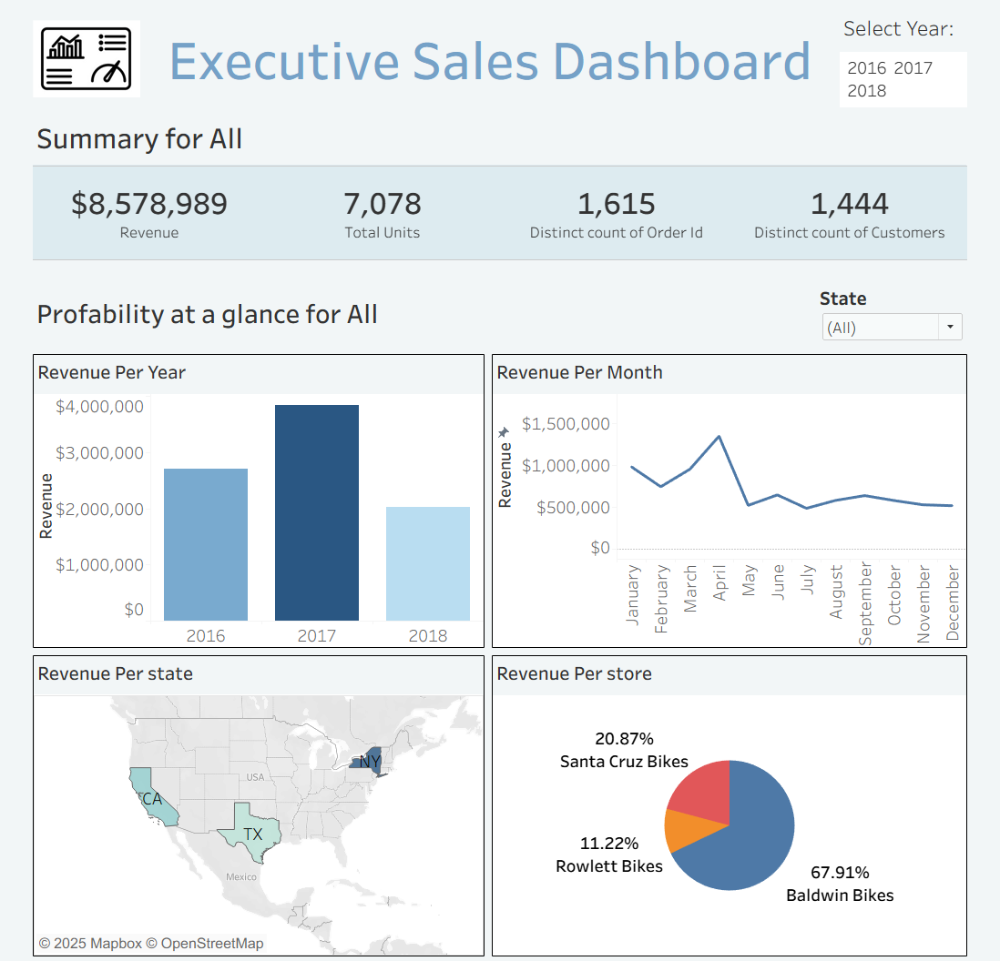
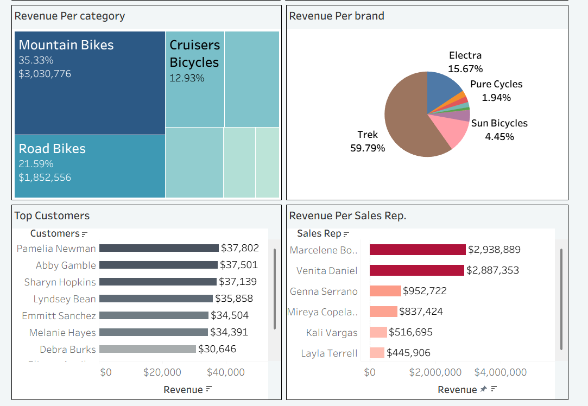

# 📊 Interactive BikeSales Dashboard – Tableau, SQL Project

This project features a **Sales Performance Dashboard** built using **Tableau**, with data extracted using **SQL** queries. It leverages the popular Superstore dataset to provide insights into regional and category-level sales performance.

---

## 📌 Project Overview

The **Sales Dashboard** analyzes regional sales performance, product categories, profit trends, and state-level comparisons. SQL was used to query relevant tables and filter key metrics before importing the cleaned data into Tableau.

---

## 🔍 Key Features

- 🌍 **State-wise Sales & Profit Visualization**
- 📅 **Monthly Sales Trend Line Chart**
- 📦 **Category Drilldown**
- 📈 **Dynamic KPIs for Sales, Profit, and Quantity**
- 🧮 **Data Preprocessing using SQL queries**
- 🎯 **Interactive Filters by Region and Year**

---
## 🛠️ Tools & Technologies

- **SQL** (for querying and filtering sales data from relational tables)
- **Tableau Public**
- **Sample Superstore Dataset**

---

## 🖼️ Dashboard Preview

---

## 📁 Files Included

- `SalesDashboard.twbx` – Tableau Packaged Workbook  
- `Dashboard_Screenshot1.png` – Dashboard visual
- `Dashboard_Screenshot2.png` – Dashboard visual   
- `README.md` – Project documentation

---

## 🧠 What I Learned

- Writing efficient **SQL queries** for analytics use cases  
- Connecting **relational databases to Tableau**  
- Creating dynamic dashboards using graphs and filters  
- Applying best practices in visual design and interactivity

---

## 🔗 Project Link

👉 [View the Live Tableau Dashboard](https://public.tableau.com/app/profile/avish.attri/viz/BikeSalesDashboard_17525794968230/Dashboard1?publish=yes)  

---
